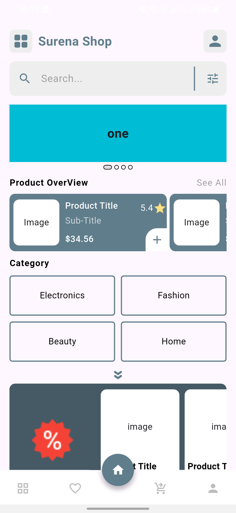
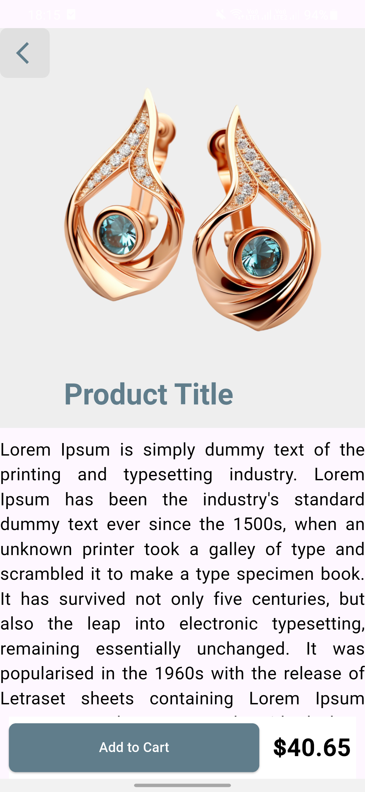
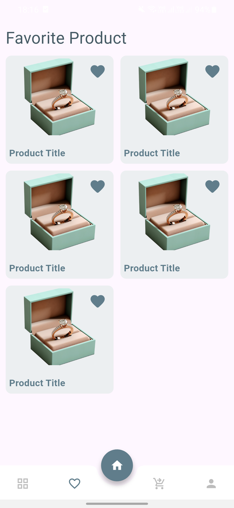
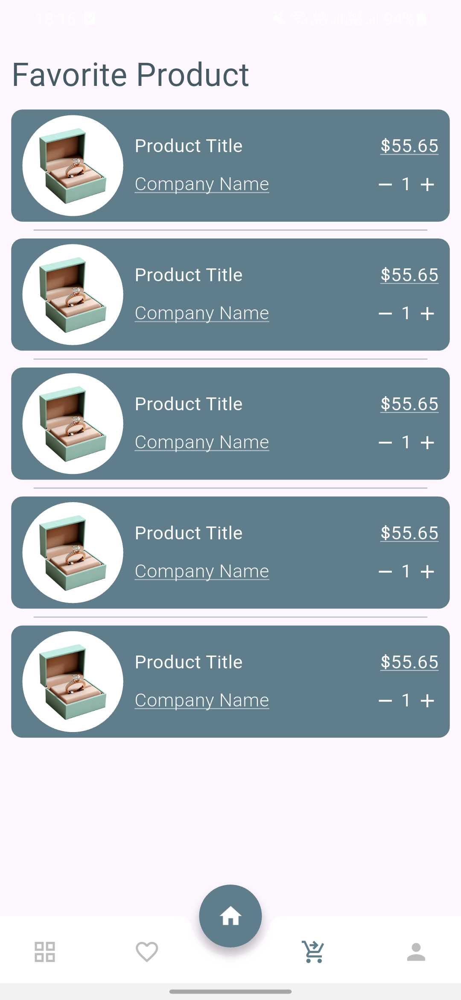
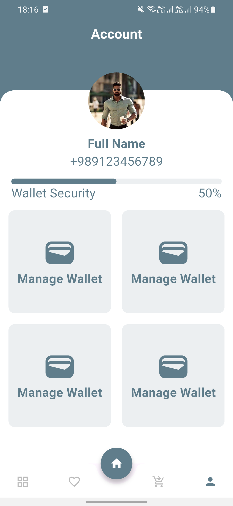

# Sorena Shop 🛍️

This project is a **UI-only Flutter application** named **Sorena Shop**, developed **without using any third-party packages**.  
The main goal of this project is to design a clean and simple user interface for an e-commerce mobile application.  

---

## ✨ Features
- 100% Flutter, no external packages used  
- Lightweight and simple design  
- Easy to customize and extend  
- Well-structured for developers  

---

## 🚀 Getting Started

To run this project, please follow the official Flutter documentation:  
👉 [Flutter - Get Started](https://docs.flutter.dev/get-started/install)

---

## 📸 Screenshots

  
  
  

  
  
  

---

## 🛠️ Development Notes

Currently, the project is written in a **hard-coded style** as it focuses mainly on the UI design.  
In the future, the code will be refactored and cleaned for better maintainability.  

If you are interested in contributing, feel free to **fork this repository** and collaborate with me to improve and develop it further.  
All contributions, feedback, and suggestions are warmly welcome. 🙏  

---

## 📬 Contact

- 🌐 Website: [iamjahangiri.ir](https://iamjahangiri.ir) | [iamjahangiri.me](https://iamjahangiri.me)  
- 📧 Email: iamjahangiri.ir@gmail.com  
